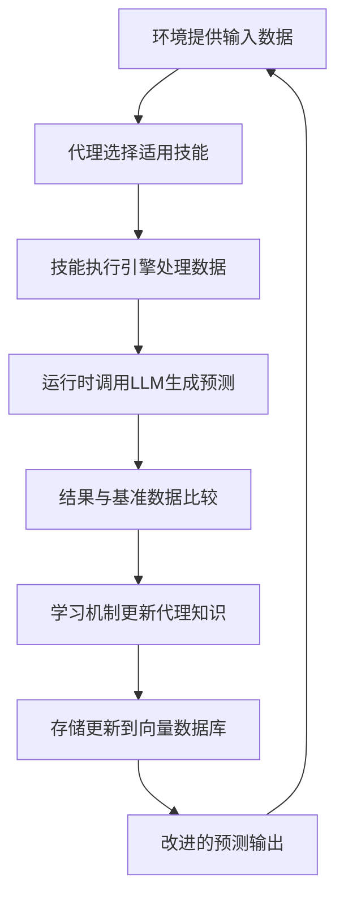

关于Adala开源Agent，内容包括其定位、核心功能与工程实践。主要内容如下：

- **Adala概述与项目定位**：介绍Adala的基本概念、设计目标、核心特性及与传统工具的差异，使用表格对比Adala与其他数据标注工具的区别。
- **核心功能特性**：详细说明Adala的自主数据标注能力、多样化数据处理技能、迭代学习机制、环境交互与反馈机制以及可扩展运行时架构，使用表格展示Adala的技能类型和示例。
- **架构与技术原理**：分析Adala的架构组件、基于LLM的推理机制、RAG模式的应用以及技能获取与优化机制。
- **工程实践与安装使用**：提供安装指南、快速开始流程、开发者高级安装方式和环境配置说明。
- **应用场景与案例**：阐述Adala在数据标注与预处理、数据增强与合成、数据质量评估与清洗以及研究与教育领域的应用，使用表格展示典型应用场景。
- **总结与展望**：总结Adala的核心价值，分析其当前局限性，并展望未来发展方向。

接下来，我将开始撰写论文正文。

-------

# Adala开源自主数据标注代理框架：技术详解与应用实践

## 1 Adala概述与项目定位

Adala（Autonomous Data Labeling Agent）是一个**开创性的开源框架**，专门用于构建和部署自主数据标注代理。该项目由HumanSignal公司（原名Heartex）开发并维护，该公司同时也是广泛使用的开源数据标注工具Label Studio的创建者。Adala代表着数据处理领域的一次**范式转变**，它不再将数据标注视为单纯的机械性任务，而是将其重新定义为一种需要**智能决策**和**持续学习**的认知过程。

Adala的设计理念源于对现代机器学习项目面临的数据处理挑战的深入分析。随着机器学习模型的复杂度和规模不断增加，对**高质量标注数据**的需求也呈指数级增长。传统的数据标注方法通常依赖于人工标注者或简单的自动化脚本，前者成本高昂且容易引入不一致性，后者则缺乏适应性和智能性。Adala通过引入**自主智能代理**的概念，试图在这两种方法之间找到平衡点——既能保持人类标注者的灵活性和判断力，又能实现自动化系统的高效率和一致性。

### 1.1 核心特性与设计目标

Adala的核心设计目标可以概括为以下几个关键方面：

- **自主性**：Adala代理能够通过**迭代学习**独立获得数据处理的技能，而不是仅仅执行预定义的规则。这种学习过程受到其操作环境、观察和反思的影响，使代理能够适应新的数据分布和标注要求。

- **可靠性**：代理基于基准数据（ground truth）构建，提供**一致且可信**的结果。通过建立明确的学习过程和验证机制，Adala确保了输出结果的可预测性和可靠性。

- **可控性**：用户可以配置输出，设定具有不同灵活度的特定约束。这种可控性确保了代理的行为与项目的特定需求保持一致，同时保留了足够的灵活性以适应各种应用场景。

- **专业化与通用性结合**：虽然Adala专门针对数据处理任务进行了优化，但它并不局限于特定类型的数据或标注任务。框架被设计为能够处理**多样化的数据处理需求**，从简单的文本分类到复杂的多模态数据转换。

### 1.2 与传统数据标注工具的差异

与传统的数据标注工具（包括其姊妹项目Label Studio）相比，Adala采用了一种**根本不同的方法**。传统工具主要关注为人类标注者提供高效的界面和工作流程，而Adala则专注于创建能够自主做出标注决策的智能代理。这种差异不仅体现在技术架构上，也体现在应用场景和用户体验上。

*表：Adala与传统数据标注工具的对比*

| **特性** | **传统数据标注工具** | **Adala** |
|---------|-------------------|-----------|
| **核心功能** | 为人类标注者提供界面 | 自主做出标注决策 |
| **学习能力** | 有限或需要外部模型 | 内置迭代学习机制 |
| **适应性** | 需要明确规则 | 适应新数据分布 |
| **扩展性** | 主要通过增加标注者 | 通过增加计算资源 |
| **一致性** | 受人类标注者影响 | 高度一致 |
| **初始设置** | 相对简单 | 需要基准数据 |

Adala的这种独特定位使其在**大规模数据处理项目**和**快速迭代的开发环境**中具有显著优势。对于需要处理不断变化的数据流或标注标准的项目，Adala的自主学习能力可以显著减少维护成本和适应时间。

## 2 核心功能特性

Adala作为一个自主数据标注代理框架，提供了一系列强大的功能特性，使其在数据处理领域脱颖而出。这些功能不仅涵盖了数据标注的传统需求，还引入了基于现代人工智能技术的创新能力。

### 2.1 自主数据标注能力

Adala最核心的功能是**高度自主的数据标注**能力。与传统自动化标注工具不同，Adala代理能够理解标注任务的上下文和语义要求，而不仅仅是应用预定义的规则或模式。这种能力使得Adala能够处理那些难以用明确规则描述的复杂标注任务。

Adala的自主标注能力建立在**大型语言模型（LLM）** 的基础上，通过精心设计的提示工程和推理机制，代理能够做出与人类标注者相似的判断。与直接使用LLM进行标注不同，Adala引入了一个**持续学习循环**，代理能够从每次标注决策中学习，逐步提高其在特定领域和任务上的表现。

### 2.2 多样化数据处理技能

Adala代理能够通过**模块化技能系统**执行多种类型的数据处理任务。每种技能代表代理能够执行的一种特定类型的数据转换或分析操作。当前版本Adala支持的主要技能包括：

- **文本分类**：将文本数据分配到预定义的类别中，支持单标签和多标签分类。
- **文本概括**：提取文本的关键信息或生成简洁的摘要。
- **问题回答**：基于给定文本内容回答相关问题。
- **翻译**：在多种语言之间进行文本翻译。
- **文本生成**：根据输入数据生成连贯的文本输出。

这些技能不是固定不变的，开发者可以通过Adala提供的API定义新的技能类型，扩展代理的能力范围。这种**可扩展的技能架构**使得Adala能够适应各种专业领域的需求，从医疗文献处理到法律文档分析。

*表：Adala支持的主要技能类型及示例*

| **技能类型** | **功能描述** | **应用示例** |
|------------|--------------|-------------|
| **文本分类** | 将文本分配到预定义类别 | 情感分析、主题分类 |
| **文本概括** | 生成文本的简洁摘要 | 新闻摘要、报告浓缩 |
| **问题回答** | 基于上下文回答问题 | 客服自动化、知识检索 |
| **翻译** | 跨语言文本转换 | 多语言数据处理 |
| **文本生成** | 根据输入生成新文本 | 内容创建、数据增强 |

### 2.3 迭代学习与自我优化机制

Adala最引人注目的特性之一是它的**迭代学习能力**。与传统的机器学习模型需要离线训练和定期更新不同，Adala代理能够在执行任务的过程中持续学习和改进。这种学习机制受到人类学习过程的启发，结合了**实践体验**、**环境反馈**和**反思过程**。

代理的学习循环包括以下几个关键阶段：

1.  **技能获取**：代理通过基准数据集初步获得技能，建立任务的基本理解。
2.  **环境交互**：代理在真实环境中应用技能，处理未标注的数据。
3.  **观察与反思**：代理评估自己的表现，识别错误和不确定性。
4.  **技能精化**：基于反馈和反思，代理调整内部表示，改进未来表现。

这种学习机制使得Adala代理能够**适应数据分布的变化**和**标注要求的演变**，从而在长期部署中保持高准确性和相关性。

### 2.4 环境交互与反馈机制

Adala代理不是孤立运行的，它们与**特定环境**进行交互，并通过这种交互获得学习和改进的机会。环境在Adala框架中扮演着多重角色：它既是数据的来源，也是反馈的提供者，还是评估代理表现的基准。

环境交互的核心是**反馈循环**机制，代理通过比较其预测与基准数据（ground truth）之间的差异来调整后续行为。这种反馈可以是直接的（明确的正确/错误指示）或间接的（通过观察结果的影响），并且可以来自多种来源，包括人类审核者、其他AI系统或客观性能指标。

### 2.5 灵活且可扩展的运行时架构

Adala采用了**灵活且可扩展的运行时架构**，允许单一技能跨多个运行时部署。这种架构支持高级部署场景，如学生/教师架构（student/teacher architecture），其中多个代理可以协同工作，共享知识和经验。

运行时架构的核心组件包括：

- **技能执行引擎**：负责执行代理的具体技能，与底层LLM交互。
- **内存管理系统**：存储和检索代理的知识和经验，支持长期学习。
- **环境接口**：管理与外部环境的通信，包括数据输入和反馈接收。
- **评估模块**：监控代理表现，提供性能指标和改进建议。

这种架构使得Adala能够适应不同的部署场景，从单个开发者的实验到企业级的大规模数据处理流水线。

## 3 架构与技术原理

Adala的架构设计体现了现代人工智能系统的最新发展理念，结合了大型语言模型的能力、自主代理的灵活性和数据工程的严谨性。本节将深入分析Adala的技术架构和实现原理。

### 3.1 架构组件与交互流程

Adala框架由多个协同工作的组件构成，形成了一个完整的数据处理生态系统。主要组件包括：

- **代理（Agent）**：核心处理单元，封装了数据处理技能和学习能力。每个代理可以专门化于特定类型的任务，多个代理可以协作处理复杂的数据处理流程。

- **技能（Skill）**：定义了代理能够执行的特定操作或转换。技能是模块化的，可以在不同代理之间共享和重用。

- **环境（Environment）**：提供代理运行的外部上下文，包括数据源、基准真值（ground truth）和反馈机制。环境定义了代理学习的目标和约束。

- **运行时（Runtime）**：执行代理任务的计算环境，通常由大型语言模型（LLM）驱动。Adala支持多种运行时配置，允许根据任务需求选择最合适的LLM后端。

- **内存与存储**：维护代理的状态、知识和经验，通常使用向量数据库实现高效的信息检索和相似性匹配。

这些组件之间的交互遵循一个明确定义的流程，如下图所示：



这个流程形成了一个**闭环学习系统**，代理通过每次交互改进其性能和可靠性。

### 3.2 基于LLM的推理机制

Adala的核心推理能力建立在**大型语言模型**之上。与其他直接使用LLM进行数据处理的方案不同，Adala实现了一个结构化的推理机制，将LLM的能力与专门的数据处理逻辑相结合。

当代理接收到输入数据时，它不会立即调用LLM，而是首先分析任务要求，选择最合适的技能，并构建一个**优化的提示结构**。这个提示不仅包含任务描述，还包括相关示例、约束条件和上下文信息。通过精心设计的提示工程，Adala能够引导LLM产生更准确和一致的结果。

推理过程的另一个关键方面是**不确定性量化**。Adala代理能够评估自己对预测的置信度，这对于识别需要人工干预的边界案例和减少错误传播至关重要。当代理识别出低置信度的预测时，它可以触发多种响应策略，包括寻求人类反馈、激活替代技能或标记数据以供进一步审查。

### 3.3 检索增强生成（RAG）模式的应用

Adala采用了**检索增强生成**（Retrieval-Augmented Generation，RAG）模式来提升标注质量和一致性。在许多方面，获取可应用于新数据的数据标签的过程类似于对LLM使用RAG的方法。

在Adala的RAG实现中，当代理需要处理新的数据输入时，它首先查询其**向量数据库**，寻找相似的已标注示例和相关知识。这些检索到的信息随后被用作LLM提示的上下文，帮助模型做出更符合领域要求和标注标准的决策。这种方法特别有效于处理**罕见案例**和**领域特定术语**，因为这些信息可能不在LLM的原始训练数据中。

RAG模式与Adala的迭代学习机制紧密结合，随着代理处理更多数据，向量数据库中的知识库不断增长和改进，从而形成一个**自我强化的质量提升循环**：更好的标注结果丰富了知识库，而更丰富的知识库又导致更好的标注结果。

### 3.4 技能获取与优化机制

Adala代理的核心能力来自于其**技能获取与优化机制**。与传统的机器学习模型需要大量标注数据训练不同，Adala代理能够从相对较少的基准示例中获取初始技能，然后通过实践不断优化这些技能。

技能获取过程包括以下阶段：

1.  **技能初始化**：通过少量示例（few-shot learning）或详细描述定义新技能。
2.  **实践应用**：代理将技能应用于真实数据，产生预测结果。
3.  **反馈收集**：从环境或人类审核者获得关于预测质量的反馈。
4.  **反思与调整**：代理分析反馈，识别错误模式，调整内部模型。
5.  **技能巩固**：将学习到的知识整合到技能定义中，提高未来性能。

这个过程受到**人类学习方式**的启发，类似于如何通过指导和实践获得新技能。这种学习机制使得Adala特别适合那些标注标准可能随时间演变或难以用明确规则定义的任务。

## 4 工程实践与安装使用

Adala不仅在设计上具有创新性，在工程实践方面也注重开发者体验和部署便利性。本节将详细介绍Adala的安装、配置和使用方法，以及在实际项目中的最佳实践。

### 4.1 安装与环境配置

Adala可以通过Python包管理器pip轻松安装，支持标准安装和从源代码安装两种方式：

**基本安装方式：**
```bash
# 通过pip安装稳定版本
pip install adala

# 或者从GitHub安装最新开发版本
pip install git+https://github.com/HumanSignal/Adala.git
```

**开发者安装方式：**
对于希望贡献代码或自定义Adala的开发者，推荐使用以下方式安装：
```bash
# 克隆仓库
git clone https://github.com/HumanSignal/Adala.git
cd Adala/

# 使用poetry安装依赖
poetry install
```

安装完成后，需要设置**环境变量**，特别是OpenAI API密钥，因为Adala默认使用OpenAI的LLM作为运行时后端：

```bash
export OPENAI_API_KEY='your-api-key-here'
```

除了OpenAI，Adala也支持其他LLM提供商，可以通过相应的配置进行设置。这种灵活性允许开发者根据成本、性能和准确性的需求选择最合适的模型。

### 4.2 快速开始指南

为了帮助用户快速上手，Adala提供了简洁的API和丰富的示例。以下是一个基本的文本分类代理的创建和使用过程：

```python
from adala.agents import Agent
from adala.skills import ClassificationSkill
from adala.environments import BasicEnvironment

# 创建分类技能
skill = ClassificationSkill(
    name="sentiment_analysis",
    instructions="判断文本的情感倾向",
    labels=["positive", "negative", "neutral"]
)

# 初始化代理
agent = Agent(
    skills=[skill],
    environment=BasicEnvironment(ground_truth_dataset=training_data)
)

# 训练代理
agent.learn()

# 使用代理进行预测
predictions = agent.run("这个产品真是太棒了！")
print(predictions)
# 输出: positive
```

这个简单示例展示了Adala的核心工作流程：**技能定义**、**代理初始化**、**学习阶段**和**预测阶段**。在实际应用中，这个过程可以扩展为包含多个技能和复杂环境配置的完整数据处理流水线。

### 4.3 高级配置与自定义

对于高级用户，Adala提供了丰富的自定义选项，允许精细控制代理的各个方面。以下是一些常见的高级配置场景：

**自定义技能开发：**
```python
from adala.skills import Skill

class CustomSkill(Skill):
    def __init__(self, name, instructions, **kwargs):
        super().__init__(name=name, instructions=instructions, **kwargs)
    
    def apply(self, input_data, **kwargs):
        # 实现自定义处理逻辑
        processed_data = self._process_input(input_data)
        return processed_data
    
    def _process_input(self, input_data):
        # 技能特定的处理逻辑
        return processed_result
```

**复杂环境配置：**
```python
from adala.environments import BaseEnvironment

class CustomEnvironment(BaseEnvironment):
    def __init__(self, database_connection, **kwargs):
        super().__init__(**kwargs)
        self.db_conn = database_connection
    
    def provide_feedback(self, agent_output):
        # 从数据库获取基准数据进行比较
        ground_truth = self._query_ground_truth(agent_output)
        return self._calculate_feedback(agent_output, ground_truth)
    
    def _query_ground_truth(self, agent_output):
        # 实现特定的基准数据查询逻辑
        return ground_truth_data
```

这些高级功能使得Adala能够适应各种专业场景和特定需求，从科学研究到工业级应用。

## 5 应用场景与案例

Adala的独特能力使其在多个领域和应用场景中都能发挥重要作用。本节将探讨Adala的主要应用场景，并通过具体案例说明其实际价值。

### 5.1 数据标注与预处理

Adala最直接的应用是**自动化数据标注**，这是机器学习工作流中传统上最劳动密集的环节之一。与基于规则或简单机器学习模型的标注工具不同，Adala能够处理模糊和上下文相关的标注任务，大大减少了所需的人工干预。

**典型应用案例：**
- **文本分类与 categorization**：为新闻文章、产品评论和用户反馈添加标签和类别。
- **情感分析**：识别文本中的主观情感倾向，用于市场研究和客户服务优化。
- **实体识别与提取**：从非结构化文本中识别和提取命名实体（人名、地名、组织等）。
- **内容审核**：自动识别和标记不适当或有害内容。

在这些应用中，Adala不仅能够提供初始标注，还能通过持续学习适应语言使用的变化和新出现的类别，从而保持长期有效性。

### 5.2 数据增强与合成

Adala可以用于**生成合成数据**和增强现有数据集，这对于训练数据有限或难以获取的场景特别有价值。通过利用LLM的生成能力，Adala可以创建高质量、多样化的训练示例，改善机器学习模型的性能和泛化能力。

**数据增强技术：**
- **文本改写与释义**：生成现有文本的变体，增加数据多样性。
- **示例生成**：基于少量示例创建新的训练样本，支持少样本学习场景。
- **错误注入与对抗示例**：测试模型的鲁棒性和边界案例处理能力。
- **多语言数据创建**：通过翻译和本地化生成多语言训练数据。

这些数据增强技术可以显著减少数据收集的成本和时间，同时提高机器学习系统的性能和可靠性。

### 5.3 数据质量评估与清洗

除了创建和标注数据，Adala还可以用于**评估数据质量**和执行数据清洗任务。通过分析数据集中的不一致性、错误和异常值，Adala代理可以帮助维护高质量的数据资源，这是有效机器学习的基础。

**数据质量应用：**
- **异常检测**：识别数据集中的异常或可疑模式。
- **一致性检查**：确保标注标准在整个数据集中一致应用。
- **错误纠正**：检测和纠正数据中的错误，包括标注错误和输入错误。
- **数据完整性评估**：识别缺失值和不完整记录，建议适当的补全策略。

在这些应用中，Adala的迭代学习能力特别有价值，因为它可以从数据质量专家那里学习识别越来越细微的数据问题模式。

### 5.4 研究与教育应用

Adala也是一个有价值的**研究和教育工具**，为学者和学生提供了探索自主代理和机器学习概念的平台。通过Adala，研究人员可以实验新的代理架构和学习算法，而学生可以获得构建和部署AI系统的实践经验。

**教育应用场景：**
- **AI代理概念教学**：通过实际示例展示自主代理的工作原理。
- **数据处理实践**：为学生提供处理真实数据的机会，而无需大量手动标注。
- **研究原型开发**：快速构建和测试新的数据处理方法原型。
- **多代理系统研究**：探索多个Adala代理协作解决复杂问题。

这些教育应用有助于培养下一代AI从业者，并推动自主代理技术的前沿研究。

*表：Adala应用场景与典型案例*

| **应用领域** | **具体应用** | **Adala的优势** | **案例示例** |
|------------|--------------|-----------------|-------------|
| **数据标注** | 文本分类、情感分析 | 减少人工标注工作量 | 产品评论情感分析 |
| **数据增强** | 文本改写、示例生成 | 提高模型泛化能力 | 训练数据多样化 |
| **数据质量** | 异常检测、一致性检查 | 提高数据集质量 | 标注错误纠正 |
| **研究教育** | 概念教学、研究原型 | 提供实践学习平台 | 多代理系统研究 |

## 6 总结与展望

Adala作为开源自主数据标注代理框架，代表了数据处理领域的一次重要创新。通过将大型语言模型的能力与自主学习机制相结合，Adala提供了一种**新颖且强大的方法**来解决传统数据处理的挑战。其核心价值在于能够减少人工标注工作量，同时保持高质量和一致性的输出结果。

### 6.1 当前局限性

尽管Adala具有显著优势，但它也面临一些**固有的局限性**，这些局限性主要源于其基于LLM的架构：

- **计算资源需求**：依赖于大型语言模型，可能需要显著的计算资源，特别是处理大规模数据集时。
- **提示工程设计**：性能在很大程度上依赖于精心设计的提示，这需要专业知识和实验。
- **领域适应成本**：虽然能够适应新领域，但这个过程可能需要相当的基准数据和调整。
- **可解释性挑战**：如同许多AI系统，Adala的决策过程可能难以完全解释和审计。

这些局限性并不削弱Adala的价值，但使用者在规划部署时应考虑这些因素，特别是在资源受限或高监管要求的环境中。

### 6.2 未来发展方向

根据HumanSignal公布的路线图，Adala的未来发展包括多个令人兴奋的方向：

- **多模态能力扩展**：超越文本处理，支持图像、音频和视频数据。
- **高级学习算法**：实现更高效和稳定的学习机制，减少所需基准数据。
- **增强的可观察性**：提供更详细的代理决策过程和性能监控工具。
- **协作代理网络**：允许多个代理协同工作，共享知识和能力。
- **云集成与部署优化**：简化大规模部署和与云服务的集成。

这些发展方向将使Adala能够应对更广泛的应用场景，并提供更加强大和可靠的数据处理能力。

### 6.3 行业影响与建议

Adala的出现反映了**人工智能行业更广泛的趋势**：从单一模型向复杂代理系统发展，从孤立处理向持续学习演进。对于考虑采用Adala或类似技术的组织，以下建议可能有助于成功部署：

1.  **从小规模开始**：从定义明确、范围受限的试点项目开始，逐步扩展应用范围。
2.  **投资质量基准数据**：准备高质量、一致的基准数据，这是代理学习的基础。
3.  **建立反馈机制**：设计有效的人类反馈循环，确保代理能够持续学习和改进。
4.  **监控性能指标**：建立明确的性能评估指标，定期监控代理的表现。
5.  **培养内部专业知识**：开发团队在提示工程和LLM技术方面的专业知识。

通过遵循这些建议，组织可以最大化Adala的价值，同时降低部署和运营风险。

Adala开源框架为数据处理带来了新的可能性，通过自主、智能的代理系统改变了传统数据标注和处理的模式。随着技术的不断发展和完善，Adala有望成为机器学习工作流中不可或缺的组成部分，推动人工智能系统更加高效、可靠和易用。