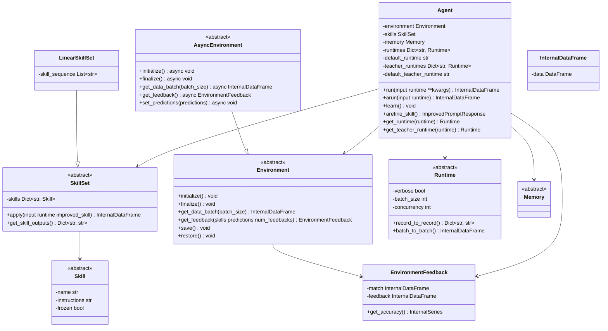
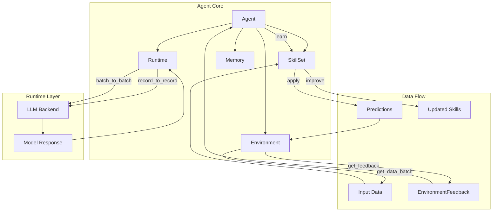
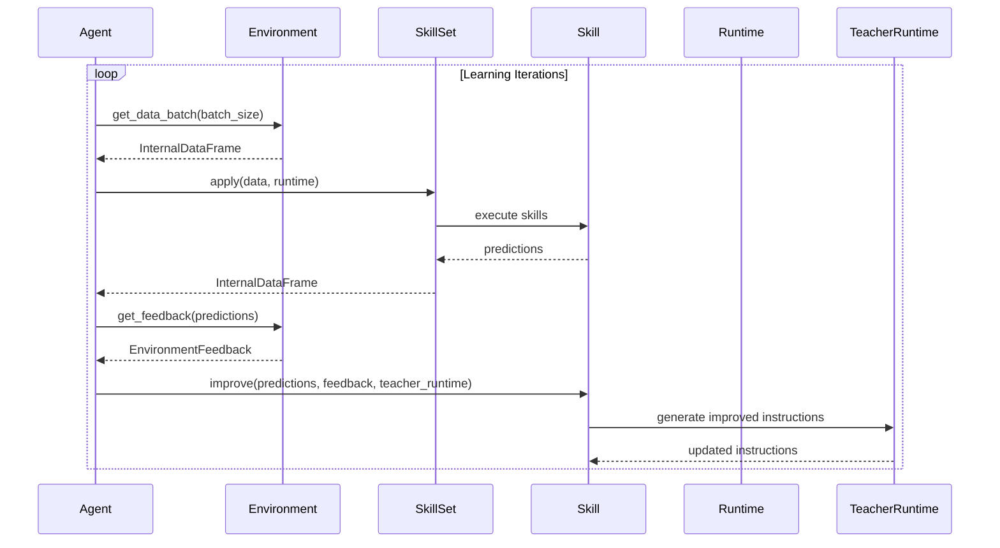
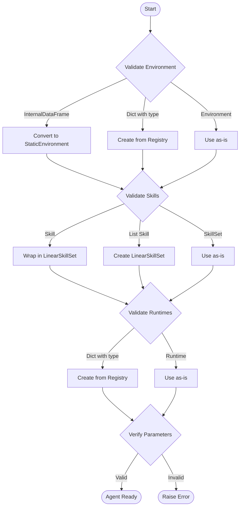
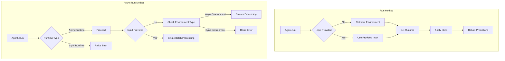
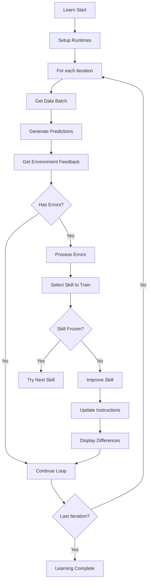
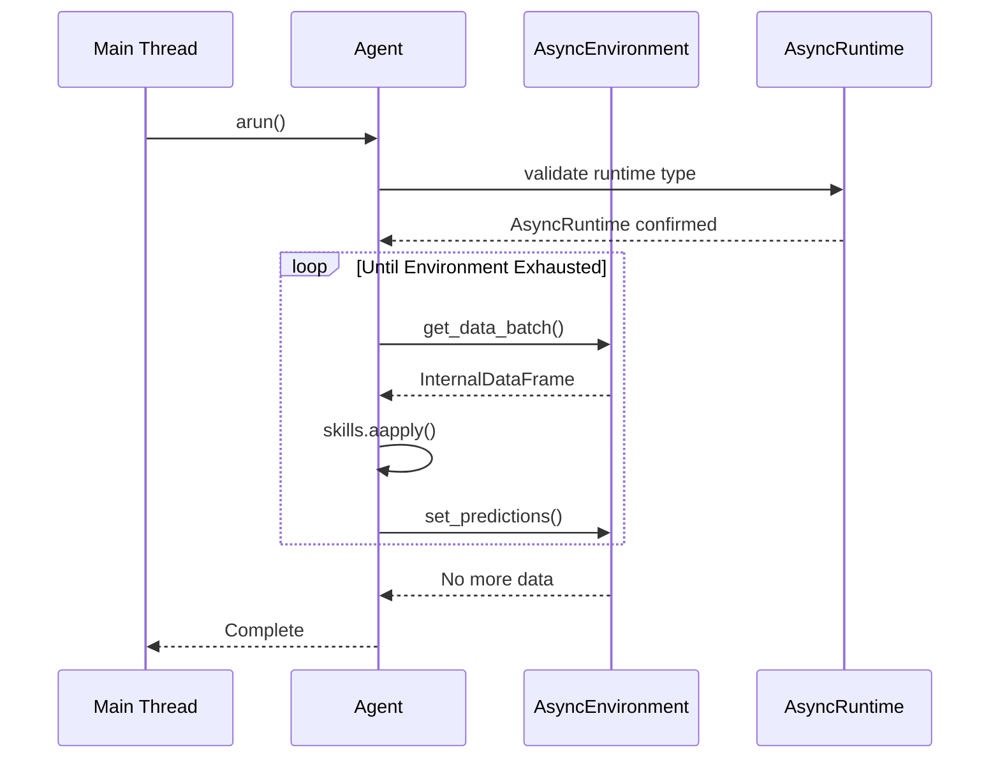

# ADALA Agent 技术文档

## 1. 系统架构图

### 1.1 整体架构类图



### 1.2 数据流架构图



### 1.3 学习循环时序图



## 2. 核心组件详解

### 2.1 Agent生命周期管理

#### 2.1.1 初始化流程



#### 2.1.2 运行时执行流程



### 2.2 学习机制详解

#### 2.2.1 学习算法流程



#### 2.2.2 技能选择策略

```python
def select_skill_to_train(self, feedback, accuracy_threshold):
    1. 计算每个技能输出的准确率
    2. 按准确率升序排序
    3. 选择第一个低于阈值的技能
    4. 返回技能名、输出名和准确率
```

### 2.3 异步架构设计

#### 2.3.1 异步执行模型



## 3. 技术实现细节

### 3.1 验证器设计

#### 3.1.1 环境验证器
```python
@field_validator("environment", mode="before")
def environment_validator(cls, v):
    """智能环境类型转换和验证"""
    if isinstance(v, InternalDataFrame):
        v = StaticEnvironment(df=v)  # 自动转换
    elif isinstance(v, dict) and "type" in v:
        v = Environment.create_from_registry(v.pop("type"), **v)
    return v
```

#### 3.1.2 运行时验证器
```python
@field_validator("runtimes", mode="before")
def runtimes_validator(cls, v):
    """运行时动态创建"""
    out = {}
    for name, value in v.items():
        if isinstance(value, dict):
            type_name = value.pop("type")
            value = Runtime.create_from_registry(type=type_name, **value)
        out[name] = value
    return out
```

### 3.2 错误处理机制

#### 3.2.1 运行时错误处理
```python
def _raise_default_runtime_error(val, runtime, runtimes, default_value):
    print_error(f"详细的错误信息和解决建议")
    raise ValueError(f"default runtime {val} not found")
```

#### 3.2.2 异步错误处理
```python
async def arun(...):
    try:
        data_batch = await self.environment.get_data_batch()
    except Exception as e:
        print_error(f"Error getting data batch: {e}")
        break
```

### 3.3 内存管理

#### 3.3.1 批处理优化
```python
# 运行时配置
runtime = Runtime(
    batch_size=100,      # 控制内存使用
    concurrency=4,       # 并行度控制
    verbose=False        # 减少内存占用
)
```

#### 3.3.2 并行处理警告
```python
# 内存使用警告
"""Warning: parallel processing doubles the memory footprint"""
```

## 4. 使用模式与最佳实践

### 4.1 基础使用模式

#### 4.1.1 简单任务执行
```python
from adala.agents import Agent
from adala.environments import StaticEnvironment
from adala.skills import LinearSkillSet, TransformSkill

# 创建智能体
agent = Agent(
    skills=LinearSkillSet(skills=[TransformSkill()]),
    environment=StaticEnvironment(df=data)
)

# 执行任务
predictions = agent.run()
```

#### 4.1.2 学习模式
```python
# 启动学习
agent.learn(
    learning_iterations=5,
    accuracy_threshold=0.95,
    batch_size=100
)
```

### 4.2 高级配置

#### 4.2.1 多运行时配置
```python
agent = Agent(
    skills=...,
    runtimes={
        'fast': OpenAIChatRuntime(model='gpt-3.5-turbo'),
        'accurate': OpenAIChatRuntime(model='gpt-4'),
        'local': LocalLLMRuntime(model='llama2')
    },
    default_runtime='fast',
    teacher_runtimes={
        'teacher': OpenAIChatRuntime(model='gpt-4')
    }
)
```

#### 4.2.2 异步批处理
```python
# 异步流处理
await agent.arun()

# 异步单批处理
result = await agent.arun(input=data_batch)
```

## 5. 扩展与集成

### 5.1 自定义环境
```python
class CustomEnvironment(Environment):
    def get_data_batch(self, batch_size):
        # 自定义数据获取逻辑
        pass
    
    def get_feedback(self, skills, predictions):
        # 自定义反馈逻辑
        pass
```

### 5.2 自定义运行时
```python
class CustomRuntime(Runtime):
    def record_to_record(self, record, ...):
        # 自定义LLM调用逻辑
        pass
```

### 5.3 配置文件驱动
```yaml
# workflow.yml
skills:
  - name: classify
    type: transform
    instructions: "Classify the text"
    input_template: "Text: {text}"
    output_template: "Category: {category}"
```

```python
# 从文件创建智能体
agent = create_agent_from_file('workflow.yml')
```