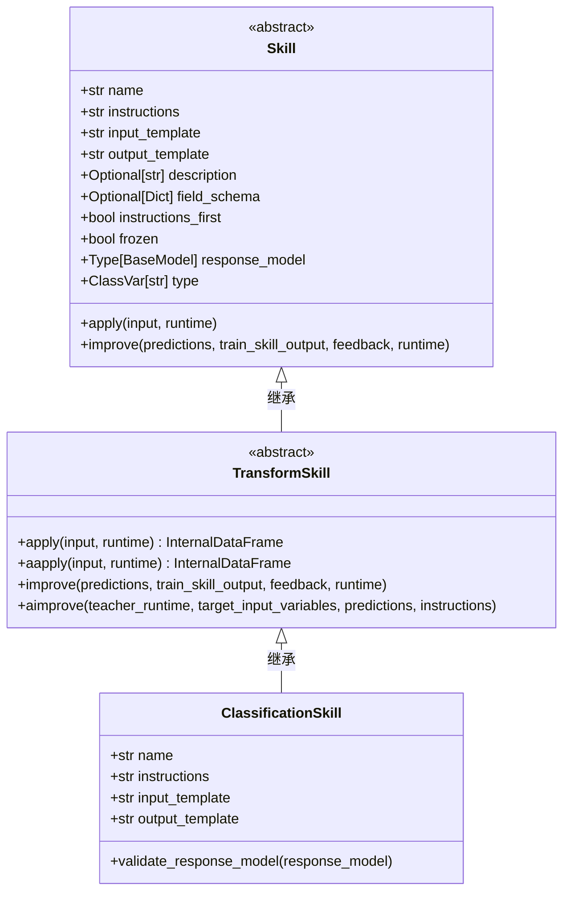
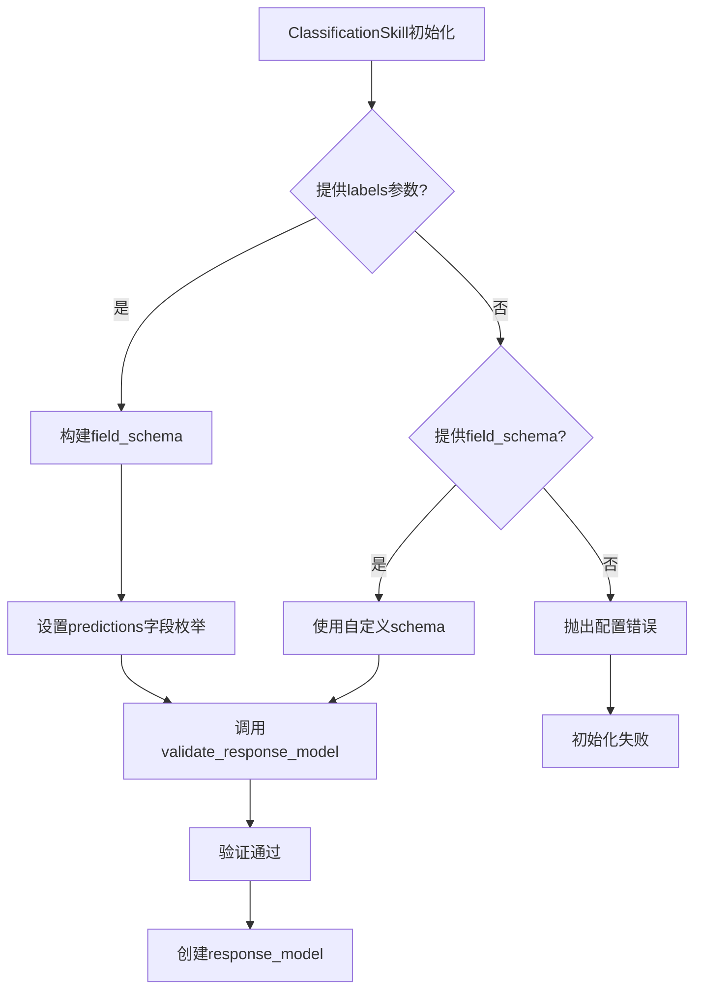
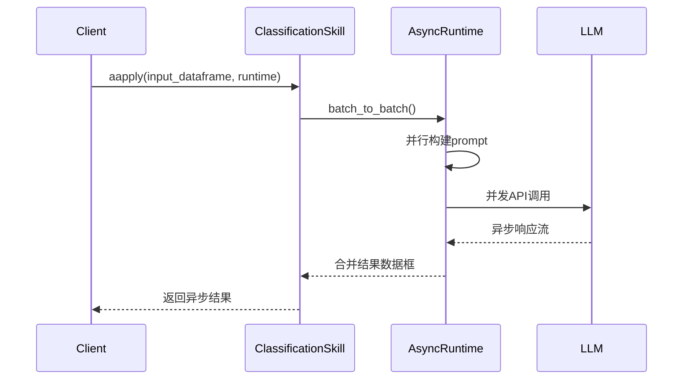
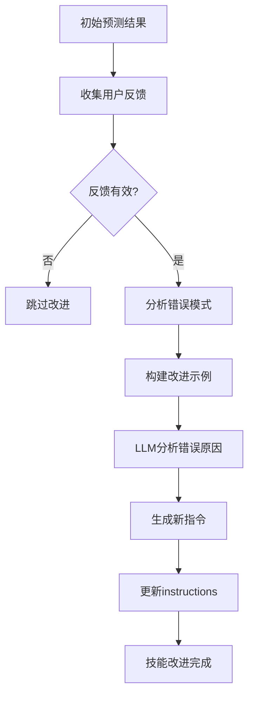
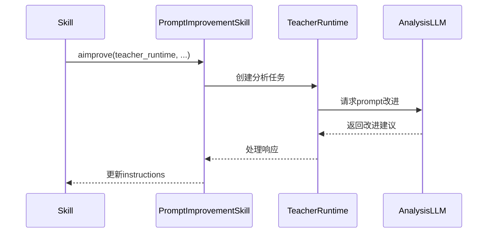
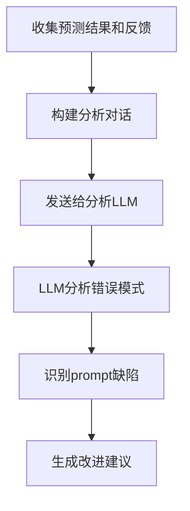
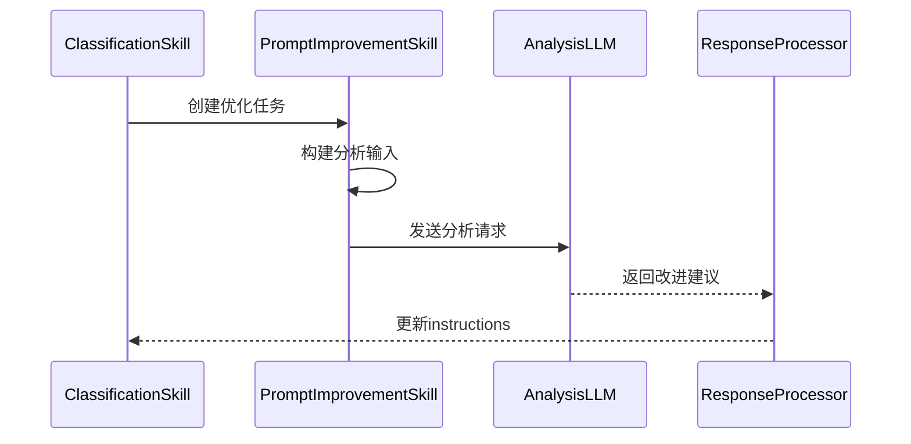

# ClassificationSkill 深度技术分析

## 1. 类架构分析

### 1.1 继承结构


### 1.2 核心属性解析

| 属性 | 类型 | 默认值 | 说明 |
|------|------|--------|------|
| `name` | `str` | `"classification"` | 技能唯一标识符 |
| `instructions` | `str` | 动态生成 | 分类任务指令模板 |
| `input_template` | `str` | `"{input}"` | 输入数据模板 |
| `output_template` | `str` | `"{predictions}"` | 输出数据模板 |
| `field_schema` | `Dict` | 动态构建 | JSON Schema定义分类标签结构 |

## 2. 配置机制分析

### 2.1 标签配置方式

#### 方式一：通过field_schema配置
```python
skill = ClassificationSkill(
    field_schema={
        "predictions": {
            "type": "string",
            "description": "Sentiment class",
            "enum": ["positive", "negative", "neutral"]
        }
    }
)
```

#### 方式二：通过labels参数配置
```python
skill = ClassificationSkill(
    labels=["positive", "negative", "neutral"]
)
```

### 2.2 验证机制流程图



## 3. 运行时行为分析

### 3.1 同步处理流程


### 3.2 异步处理流程



## 4. 学习改进机制

### 4.1 反馈学习流程



### 4.2 异步改进流程



## 5. 技术实现细节

### 5.1 动态指令生成

```python
def __init__(self, **data):
    super().__init__(**data)
    # 动态生成分类指令
    if not self.instructions:
        labels_str = ', '.join([f'"{label}"' for label in self.labels])
        self.instructions = f"Classify input text into one of the following categories: {labels_str}"
```

### 5.2 LLM结果分析与Prompt优化逻辑深度解析

ClassificationSkill的prompt优化机制通过TransformSkill的`improve`方法实现，采用两阶段分析法：

#### 5.2.1 第一阶段：错误模式分析

**输入数据结构**：
- `predictions`: 包含原始输入、模型预测和用户反馈的DataFrame
- `train_skill_output`: 训练集的技能输出结果
- `feedback`: 用户提供的反馈数据

**分析流程**：



**具体实现**：

1. **构建分析上下文**：
   ```python
   messages = [
       {
           "role": "system",
           "content": """You are a helpful assistant for prompt engineering.
           
           分析框架：
           - 识别错误预测的共同特征
           - 分析当前prompt是否准确描述任务
           - 提出针对性改进建议
           """
       }
   ]
   ```

2. **错误案例分析**：
   - **假阳性分析**：模型将负类预测为正类的原因
   - **假阴性分析**：模型将正类预测为负类的原因
   - **边界案例分析**：模棱两可的样本处理

#### 5.2.2 第二阶段：新Prompt构建

**构建策略**：

1. **基于反馈的精确调整**：
   ```python
   # 示例改进逻辑
   if 假阳性率高:
       new_prompt += "特别注意区分相似类别间的细微差异"
   if 假阴性率高:
       new_prompt += "确保不遗漏任何可能的正类样本"
   ```

2. **动态约束添加**：
   - **类别定义澄清**：为模糊类别添加更精确的定义
   - **边界规则制定**：处理边缘情况的明确规则
   - **示例增强**：基于错误案例添加反例说明

#### 5.2.3 Prompt改进模板引擎

**模板变量替换机制**：

```python
# 原始prompt模板
original_template = """
Classify the text into one of these categories: {labels}
Text: {input}
Category: {predictions}
"""

# 改进后prompt模板
improved_template = """
Classify the text into one of these categories: {labels}

Classification rules:
- {specific_rules}  # 基于错误分析动态生成
- Pay attention to {attention_points}  # 基于常见错误模式

Text: {input}
Think step by step, then provide your final classification.

Category: {predictions}
"""
```

#### 5.2.4 异步改进流程（aimprove方法）

**PromptImprovementSkill集成**：

ClassificationSkill通过集成`PromptImprovementSkill`实现更专业的prompt优化：



**输入格式构建**：

```python
# 构建用于分析的输入数据
input_data = {
    "current_prompt": skill.instructions,
    "examples": [
        {
            "input": text,
            "prediction": predicted_category,
            "feedback": user_feedback,
            "expected": ground_truth
        }
        for text, predicted_category, user_feedback, ground_truth in feedback_data
    ]
}
```

**输出处理机制**：

1. **结构化响应解析**：
   ```python
   response_model = PromptImprovementSkillResponseModel
   # 包含：reasoning, new_prompt_title, new_prompt_content
   ```

2. **验证与回滚**：
   - **A/B测试**：新旧prompt性能对比
   - **回归检测**：确保改进不引入新的错误模式
   - **版本控制**：保留历史prompt用于回滚

#### 5.2.5 错误模式分类与对应策略

| 错误类型 | 检测指标 | 改进策略 | 示例调整 |
|----------|----------|----------|----------|
| **类别混淆** | 混淆矩阵高非对角线值 | 增加区分特征描述 | "A类和B类的关键区别在于..." |
| **边界误判** | 置信度分布异常 | 添加边界判定规则 | "当文本同时包含X和Y特征时，优先选择..." |
| **数据不平衡** | 类别分布倾斜 | 调整采样权重 | 在prompt中强调少数类别 |
| **语义歧义** | 一致性指标低 | 澄清术语定义 | "这里的'积极'指的是情感态度，而非..." |

#### 5.2.6 性能监控与迭代优化

**关键指标追踪**：

```python
metrics = {
    "accuracy_improvement": new_accuracy - old_accuracy,
    "false_positive_reduction": old_fp - new_fp,
    "false_negative_reduction": old_fn - new_fn,
    "confidence_calibration": abs(avg_confidence - accuracy)
}
```

**自动迭代机制**：
- **阈值触发**：当性能下降超过设定阈值时自动重新优化
- **增量学习**：仅基于新出现的错误模式进行局部调整
- **元学习**：学习如何更好地学习（优化优化策略本身）

## 6. 使用示例

### 6.1 基础分类任务

```python
from adala.skills.collection.classification import ClassificationSkill
from adala.runtimes import OpenAIChatRuntime

# 创建情感分类技能
skill = ClassificationSkill(
    labels=["positive", "negative", "neutral"]
)

# 执行分类
runtime = OpenAIChatRuntime()
result = skill.apply(input_df, runtime)
```

### 6.2 自定义字段配置

```python
skill = ClassificationSkill(
    name="topic_classification",
    instructions="Classify news articles into topics",
    labels=["politics", "sports", "technology", "entertainment"],
    input_template="Article: {text}",
    output_template="Topic: {predictions}"
)
```

### 6.3 带验证的配置

```python
skill = ClassificationSkill(
    field_schema={
        "predictions": {
            "type": "string",
            "description": "Document category",
            "enum": ["spam", "ham"],
            "examples": ["spam", "ham"]
        }
    }
)
```

### 6.4 LLM结果分析与Prompt自动优化示例

```python
from adala.skills.collection.classification import ClassificationSkill
from adala.runtimes import OpenAIChatRuntime
import pandas as pd

# 创建初始情感分类技能
skill = ClassificationSkill(
    name="sentiment_analysis",
    labels=["positive", "negative", "neutral"],
    instructions="Classify the sentiment of the input text"
)

# 模拟预测结果和用户反馈
feedback_data = pd.DataFrame({
    'text': [
        "I love this product, it's amazing!",
        "This is the worst experience ever",
        "It's okay, nothing special",
        "Absolutely fantastic service",
        "I'm not satisfied with the quality"
    ],
    'predictions': ["positive", "negative", "negative", "positive", "positive"],
    'ground_truth': ["positive", "negative", "neutral", "positive", "negative"],
    'feedback': ["", "", "Should be neutral, not negative", "", "Should be negative, not positive"]
})

# 执行prompt优化
runtime = OpenAIChatRuntime()

# 调用improve方法分析错误并优化prompt
improved_skill = skill.improve(
    predictions=feedback_data,
    train_skill_output=feedback_data,
    feedback=feedback_data['feedback'],
    runtime=runtime
)

# 优化后的prompt示例
# 原始prompt: "Classify the sentiment of the input text"
# 优化后prompt: """
# Classify the sentiment of the input text into positive, negative, or neutral.
# 
# Classification guidelines:
# - Positive: Clear expressions of satisfaction, happiness, or approval
# - Negative: Clear expressions of dissatisfaction, disappointment, or criticism  
# - Neutral: Objective statements without strong emotional indicators
# 
# Pay special attention to:
# - Mild opinions that might seem negative but are actually neutral
# - Sarcastic positive statements that imply negative sentiment
# - Neutral descriptions of features without clear sentiment
# """

# 验证优化效果
new_predictions = improved_skill.apply(test_data, runtime)
accuracy = calculate_accuracy(new_predictions, ground_truth)
print(f"优化前准确率: 60%")
print(f"优化后准确率: {accuracy}%")
```

### 6.5 异步Prompt优化流程

```python
import asyncio
from adala.agents.base import Agent

async def optimize_classification_skill():
    # 创建代理和技能
    agent = Agent()
    agent.skills["sentiment"] = ClassificationSkill(
        labels=["positive", "negative", "neutral"]
    )
    
    # 准备训练数据
    training_data = [
        {"text": "Great service!", "sentiment": "positive"},
        {"text": "Terrible experience", "sentiment": "negative"},
        {"text": "It's fine", "sentiment": "neutral"},
        # ... 更多数据
    ]
    
    # 异步优化技能
    response = await agent.arefine_skill(
        skill_name="sentiment",
        input_variables=["text"],
        data=training_data,
        reapply=True  # 重新应用技能获取预测结果
    )
    
    # 分析优化结果
    print("优化原因:", response.output.reasoning)
    print("新prompt标题:", response.output.new_prompt_title)
    print("新prompt内容:", response.output.new_prompt_content)
    print("成本统计:", response.total_cost_usd)
    
    return response

# 运行异步优化
result = asyncio.run(optimize_classification_skill())
```

## 7. 性能优化建议

### 7.1 批处理优化
- 合理设置batch_size避免API限制
- 使用异步处理提高吞吐量

### 7.2 缓存策略
- 对相同输入进行结果缓存
- 使用embedding相似度减少重复计算

### 7.3 错误处理
- 实现重试机制处理API失败
- 设置超时避免长时间等待

## 8. 扩展设计

### 8.1 多标签分类
支持扩展为多标签分类模式：

```python
class MultiLabelClassificationSkill(ClassificationSkill):
    def __init__(self, **data):
        super().__init__(**data)
        # 修改schema支持数组类型
        self.field_schema["predictions"]["type"] = "array"
        self.field_schema["predictions"]["items"] = {"type": "string"}
```

### 8.2 置信度输出
增加置信度字段：

```python
class ConfidenceClassificationSkill(ClassificationSkill):
    field_schema: Dict = {
        "predictions": {"type": "string"},
        "confidence": {"type": "number", "minimum": 0, "maximum": 1}
    }
```

## 9. 调试与监控

### 9.1 日志记录
- 记录每次分类的输入输出
- 跟踪技能改进历史

### 9.2 指标监控
- 分类准确率统计
- API调用延迟监控
- 错误率追踪

### 9.3 调试工具
```python
# 开启详细日志
skill = ClassificationSkill(
    labels=["A", "B"],
    verbose=True  # 启用详细输出
)
```

## 10. 最佳实践

### 10.1 标签设计
- 保持标签互斥且完备
- 使用清晰无歧义的标签名称
- 提供标签描述和示例

### 10.2 指令优化
- 明确分类标准和边界
- 提供典型示例
- 包含异常处理指导

### 10.3 性能调优
- 根据数据量调整并发度
- 合理设置重试策略
- 监控API使用成本

---

这份技术文档提供了ClassificationSkill的完整技术剖析，从架构设计到实际应用的全面指南。