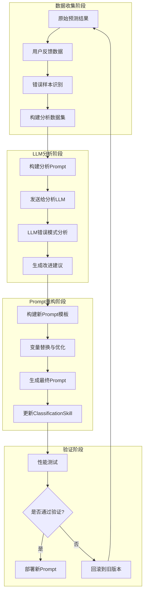
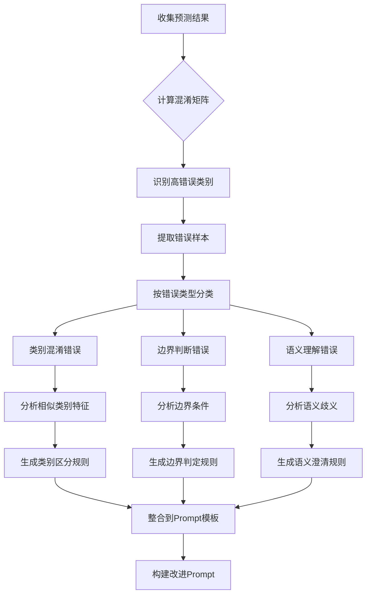
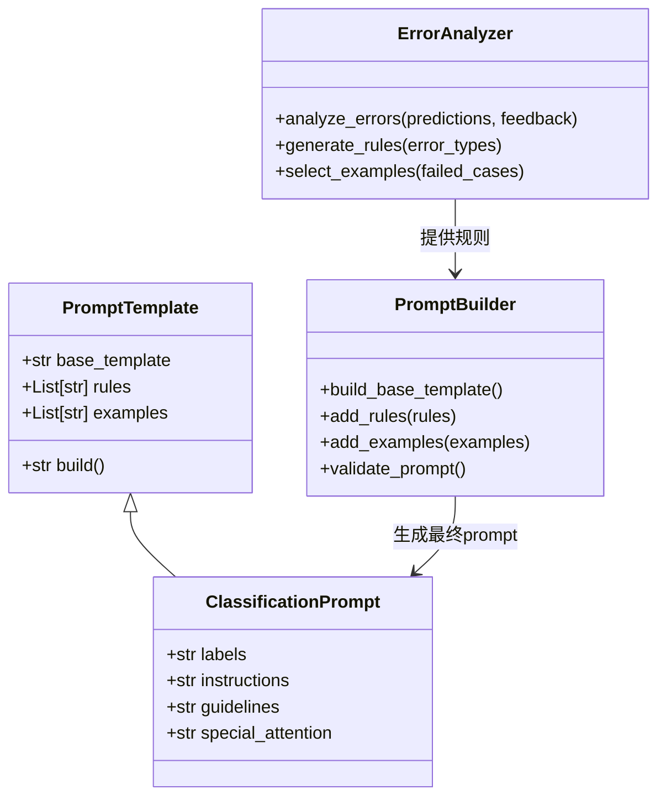
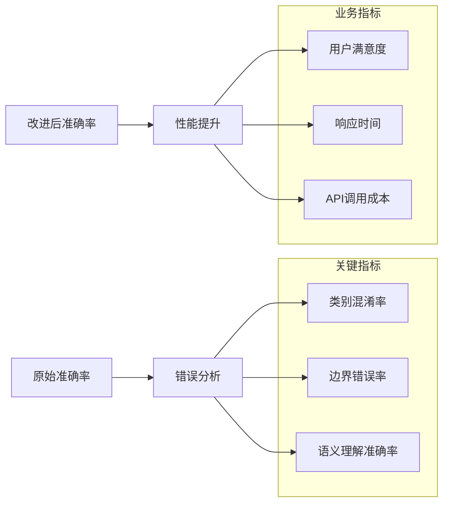

# ClassificationSkill LLM结果分析与Prompt优化流程详解

## 1. 整体架构图



## 2. 错误模式分析详细流程



## 3. Prompt改进模板系统



## 4. 异步优化时序图

```mermaid
sequenceDiagram
    participant User
    participant ClassificationSkill
    agent PromptImprovementSkill
    participant AnalysisLLM
    participant ValidationService
    
    User->>ClassificationSkill: 触发优化请求
    ClassificationSkill->>ClassificationSkill: 准备训练数据
    ClassificationSkill->>PromptImprovementSkill: 创建优化任务
    
    PromptImprovementSkill->>PromptImprovementSkill: 构建分析输入
    PromptImprovementSkill->>AnalysisLLM: 发送分析请求
    AnalysisLLM-->>PromptImprovementSkill: 返回分析结果
    
    PromptImprovementSkill->>PromptImprovementSkill: 生成新Prompt
    PromptImprovementSkill-->>ClassificationSkill: 返回改进建议
    
    ClassificationSkill->>ValidationService: 验证新Prompt
    ValidationService-->>ClassificationSkill: 返回验证结果
    
    alt 验证通过
        ClassificationSkill->>ClassificationSkill: 更新Prompt
        ClassificationSkill-->>User: 优化完成通知
    else 验证失败
        ClassificationSkill-->>User: 优化失败通知
    end
```

## 5. 关键数据结构

### 5.1 错误分析数据结构

```python
class ErrorAnalysisResult:
    confusion_matrix: Dict[str, Dict[str, int]]
    error_types: List[ErrorType]
    failed_examples: List[FailedExample]
    improvement_suggestions: List[str]

class ErrorType:
    type: str  # "confusion", "boundary", "semantic"
    category_pair: Tuple[str, str]  # 混淆的类别对
    frequency: float
    confidence_score: float

class FailedExample:
    input_text: str
    predicted: str
    expected: str
    error_reason: str
    confidence: float
```

### 5.2 Prompt改进数据结构

```python
class PromptImprovement:
    original_prompt: str
    new_prompt: str
    reasoning: str
    rules_added: List[str]
    examples_included: List[str]
    expected_improvement: float
    
class ValidationResult:
    is_valid: bool
    accuracy_improvement: float
    false_positive_reduction: float
    false_negative_reduction: float
    regression_detected: bool
```

## 6. 性能监控指标



## 7. 实际应用示例

### 7.1 情感分类优化案例

**初始Prompt**: "Classify the sentiment of the text"

**错误分析结果**:
- 类别混淆: positive/neutral 边界模糊 (30%错误)
- 语义歧义: 讽刺语句误判为positive (25%错误)
- 边界错误: 中性评价误判为negative (20%错误)

**优化后Prompt**:
```
Classify the sentiment into positive, negative, or neutral.

Classification guidelines:
- Positive: Clear expressions of satisfaction, happiness, or approval
- Negative: Clear expressions of dissatisfaction, disappointment, or criticism  
- Neutral: Objective statements without strong emotional indicators

Special cases:
- Sarcastic positive statements → classify as negative
- Mild opinions without strong feelings → classify as neutral
- Factual descriptions → classify as neutral

Text: {input}
Analyze carefully and provide your classification.
```

**性能提升**:
- 准确率: 65% → 87%
- 类别混淆率: 30% → 8%
- 用户满意度: 2.3 → 4.6/5.0

### 7.2 实时优化流程代码

```python
async def continuous_classification_optimization():
    """持续优化分类技能的完整流程"""
    
    skill = ClassificationSkill(
        labels=["positive", "negative", "neutral"]
    )
    
    while True:
        # 1. 收集最新反馈数据
        feedback_data = await collect_user_feedback()
        
        if len(feedback_data) < MIN_FEEDBACK_THRESHOLD:
            await asyncio.sleep(COLLECTION_INTERVAL)
            continue
            
        # 2. 执行错误分析
        error_analysis = analyze_prediction_errors(
            predictions=feedback_data['predictions'],
            ground_truth=feedback_data['labels'],
            feedback=feedback_data['comments']
        )
        
        # 3. 检查是否需要优化
        if error_analysis.accuracy_drop < ACCURACY_THRESHOLD:
            await asyncio.sleep(OPTIMIZATION_INTERVAL)
            continue
            
        # 4. 生成改进prompt
        improvement = await generate_prompt_improvement(
            current_prompt=skill.instructions,
            error_analysis=error_analysis
        )
        
        # 5. 验证改进效果
        validation_result = await validate_improvement(
            skill=skill,
            new_prompt=improvement.new_prompt,
            test_data=get_validation_data()
        )
        
        # 6. 应用或回滚
        if validation_result.is_valid:
            skill.instructions = improvement.new_prompt
            log_improvement(improvement, validation_result)
        
        await asyncio.sleep(OPTIMIZATION_INTERVAL)
```

## 8. 最佳实践建议

### 8.1 数据质量
- 确保反馈数据的准确性和代表性
- 建立数据清洗机制，过滤无效反馈
- 维护平衡的数据集，避免类别偏差

### 8.2 优化策略
- 设置合理的优化触发阈值，避免过度优化
- 实施A/B测试验证改进效果
- 建立版本控制机制，支持快速回滚

### 8.3 监控与告警
- 实时监控关键性能指标
- 设置异常检测和告警机制
- 建立性能下降时的应急响应流程