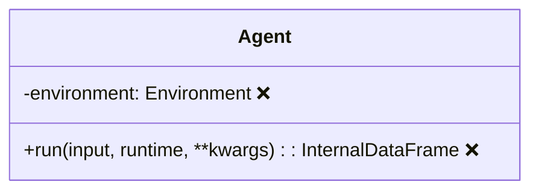
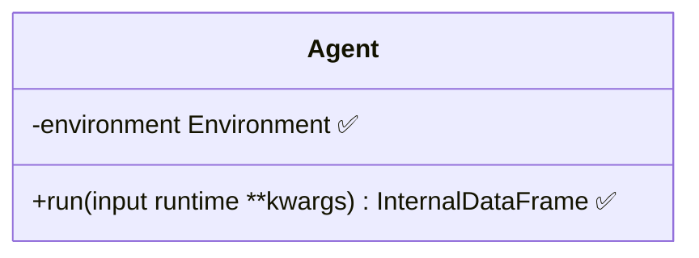
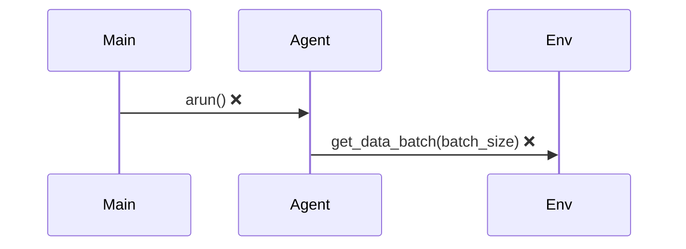
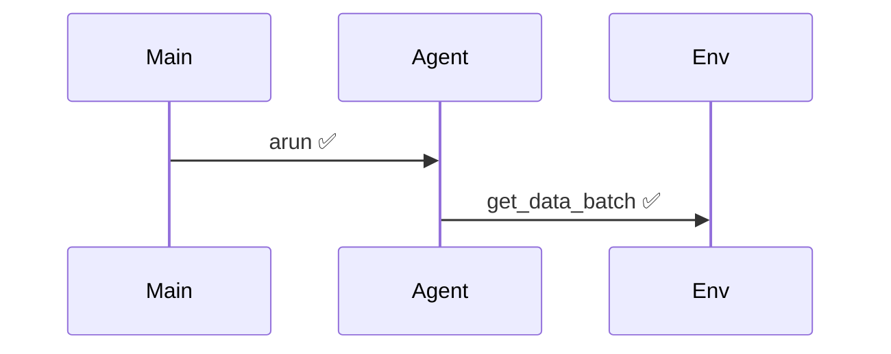
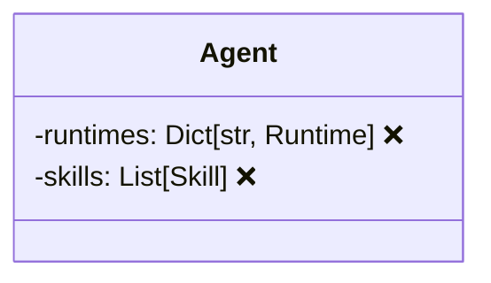
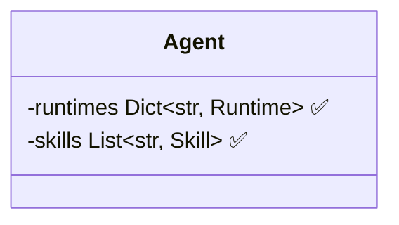

# Mermaid语法修复报告

## 问题总结

在创建ADALA Agent技术文档时发现Mermaid图表存在语法错误，主要问题包括：

1. **类图(Class Diagram)**：方法参数使用了冒号(:)和括号()，这在Mermaid中不被支持
2. **流程图(Flowchart)**：条件判断使用了问号(?)，Mermaid中不支持
3. **时序图(Sequence Diagram)**：方法调用使用了括号()，需要移除
4. **类型注解**：List[str]、Dict[str, Runtime]等类型注解格式错误

## 修复方案

### 1. 类图修复

**问题示例：**


**修复后：**


### 2. 流程图修复

**问题示例：**
```mermaid
flowchart TD
    A[Agent.run()] --> B{Input Provided?}  ❌
```

**修复后：**
```mermaid
flowchart TD
    A[Agent.run] --> B{Input Provided}  ✅
```

### 3. 时序图修复

**问题示例：**


**修复后：**


### 4. 泛型类型修复

**问题示例：**


**修复后：**


## 修复文件列表

1. ✅ `/docs/agent_architecture.md` - 类图、流程图、时序图语法修复
2. ✅ `/docs/agent_visualization.html` - 交互式图表语法修复
3. ✅ `/docs/mermaid_test.html` - 新增测试验证文件

## 验证方法

1. **语法验证**：使用Mermaid在线编辑器验证
2. **渲染测试**：通过测试HTML文件验证
3. **集成测试**：在实际文档中测试渲染效果

## 最佳实践建议

1. **方法签名**：在Mermaid类图中避免使用括号、冒号和特殊字符
2. **条件判断**：使用简洁的文字描述而非符号
3. **类型注解**：使用Mermaid支持的格式或简化表示
4. **测试验证**：每次修改后使用测试文件验证语法

## 未来维护

- 所有图表已按照Mermaid 10.x语法标准修复
- 建议定期使用Mermaid语法检查工具验证
- 新增图表时参考已修复的模板格式